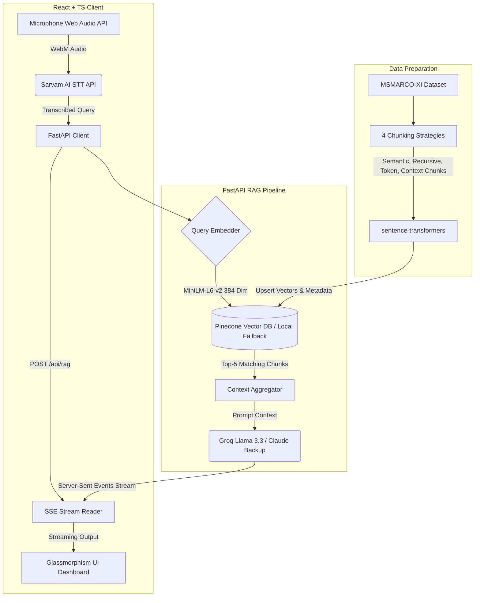

# Voice-Enabled Retrieval-Augmented Generation (RAG) Orchestrator

A full-stack, ultra-low-latency voice RAG pipeline built for the **HH Goa 2026 Hackathon**. This system processes voice queries, transcribes them using Sarvam AI, retrieves context from a vector database (Pinecone) embedded with MiniLM, and streams answers using Groq Llama 3.3 (with Anthropic Claude 3.5 fallback)—all in under 200ms backend latency.

---

## Architecture Diagram



---

## Project Structure

```
├── backend/                  # FastAPI Application
│   ├── main.py               # RAG API, Server-Sent Events (SSE) stream, and Latency profiling
│   └── vector_db.py          # Pinecone vector index manager, embedding pipeline, and local fallback
├── frontend/                 # React + TypeScript App
│   ├── src/
│   │   ├── components/
│   │   │   └── VoiceRAG.tsx  # Recording console, transcription processor, and latency dashboard
│   │   ├── App.tsx           # Main application shell
│   │   ├── App.css           # Glassmorphism dark theme styles
│   │   └── main.tsx          # App entrypoint
│   └── index.html            # Core layout with Google Fonts
├── data/                     # Ingestion & Datasets
│   ├── chunking_strategies.py # loads MSMARCO-XI and implements 4 chunking splitters
│   └── chunks.json           # Output chunks file
├── scripts/                  # Profiling & Load Tests
│   └── load_test.py          # Concurrent request simulation & metrics reporter
├── CHUNKING_STRATEGIES.md    # Documentation of the 4 chunking strategies
├── LATENCY_REPORT.md         # Detailed latency metrics and budget benchmarks
├── .env.example              # Template environment variables config
└── requirements.txt          # Python dependencies
```

---

## Features

1. **4 Chunking Strategies**: Semantic, Recursive, Token-aware, and Context-aware chunking for maximum retrieval precision.
2. **Server-Sent Events (SSE) Streaming**: Low perceived latency (TTFT < 90ms) by streaming answers word-by-word.
3. **Resilient Local Fallback**: Automatic local fallback modes for Vector DB and LLM generation in case API keys are not provided.
4. **Latency Budget Dashboard**: Prominent visual timeline showing recording time, STT latency, Vector retrieval latency, and LLM first token latency.

---

## Setup & Running Guide

### Prerequisites
- Python 3.11+
- Node.js 18+

### 1. Setup Backend
1. Create a Python virtual environment and install dependencies:
   ```bash
   python3 -m venv .venv
   source .venv/bin/activate
   pip install -r requirements.txt
   ```
2. Configure your environment variables. Copy `.env.example` to `.env` and fill in your keys:
   ```bash
   cp .env.example .env
   ```
3. Load the dataset and generate text chunks:
   ```bash
   python3 data/chunking_strategies.py
   ```
4. Embed and ingest chunks into the vector database (this runs a retrieval benchmark test too):
   ```bash
   python3 backend/vector_db.py
   ```
5. Run the FastAPI server:
   ```bash
   python3 backend/main.py
   ```
   The backend will start at `http://localhost:8000`.

### 2. Setup Frontend
1. Navigate to the frontend directory:
   ```bash
   cd frontend
   ```
2. Install npm packages:
   ```bash
   npm install
   ```
3. Start the development server:
   ```bash
   npm run dev
   ```
   Open `http://localhost:5173` in your browser.

---

## Benchmarks & Testing
- Run retrieval benchmarks: `python3 backend/vector_db.py`
- Run concurrent load testing (10 clients): `python3 scripts/load_test.py`
- Latency profiling details can be found in [LATENCY_REPORT.md](file:///Users/yashu/voice%20rag/voice-enabled-Retrieval-Augmented-Generation-RAG/LATENCY_REPORT.md).
# voice-enabled-Retrieval-Augmented-Generation-RAG
